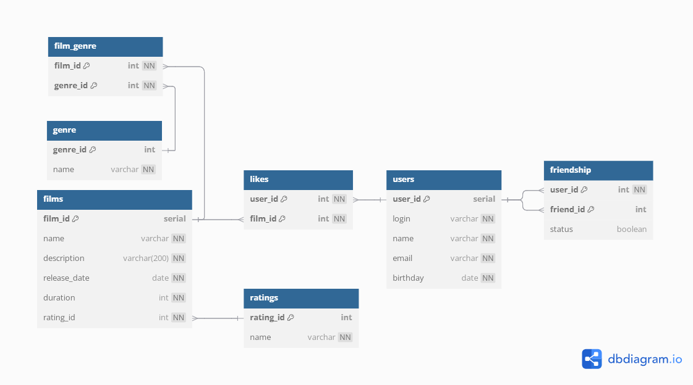

Spring Boot приложение Filmorate
---------------------
ER-диаграмма
---------------------

---------------------
Описание базы данных
---------------------
Проект Filmorate представляет собой платформу для управления информацией о фильмах, жанрах, рейтингах, пользователях, их дружбе и лайках. 
База данных состоит из нескольких таблиц, связанных между собой через внешние ключи. 
---------------------
Основные таблицы:
---------------------
Таблицы базы данных

1. `films`
- `film_id` — уникальный идентификатор фильма (первичный ключ)
- `name` — название фильма
- `description` — описание фильма
- `release_date` — дата выхода фильма
- `duration` — продолжительность фильма в минутах
- `rating_id` — идентификатор рейтинга (внешний ключ к таблице `ratings`)

2. `genre`
- `genre_id` — уникальный идентификатор жанра (первичный ключ)
- `name` — название жанра

3. `film_genre`
- `film_id` — идентификатор фильма (внешний ключ к таблице `films`)
- `genre_id` — идентификатор жанра (внешний ключ к таблице `genre`)

4. `ratings`
- `rating_id` — уникальный идентификатор рейтинга (первичный ключ)
- `name` — название рейтинга (например, G, PG, PG-13, R, NC-17)

5. `user`
- `user_id` — уникальный идентификатор пользователя (первичный ключ)
- `login` — логин пользователя
- `name` — имя пользователя
- `email` — электронная почта пользователя
- `birthday` — дата рождения пользователя

6. `likes`
- `user_id` — идентификатор пользователя (внешний ключ к таблице `user`)
- `film_id` — идентификатор фильма (внешний ключ к таблице `films`)

7. `friendship`
- `user_id` — идентификатор пользователя (внешний ключ к таблице `user`)
- `friend_id` — идентификатор друга (внешний ключ к таблице `user`)
- `status` — статус дружбы (например, "подтверждено", "ожидает подтверждения")

Примеры SQL запросов
---------------------
Добавить нового пользователя
---------------------
```postgres-sql
INSERT INTO users (login, name, email, birthday)
VALUES ('email@email.com', 'login', 'Name', '2025-01-01');
```
---------------------
Добавить фильм
---------------------
```postgres-sql
INSERT INTO films (name, description, release_date, duration, rating_id)
VALUES ('name', 'description film', '2000-01-01', 100, 3);
```
---------------------
Получить топ 10 рейтинговых фильмов
---------------------
```postgres-sql
SELECT f.id, f.name, f.description, f.releaseDate, f.duration, COUNT(l.user_id) AS likes_count
FROM films f
LEFT JOIN likes l ON f.film_id = l.film_id
GROUP BY f.film_id
ORDER BY likes_count DESC
LIMIT 10;
```
