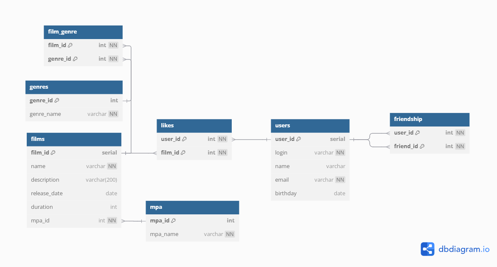

# Filmorate

## ER-диаграмма


## Описание базы данных
Проект Filmorate представляет собой платформу для управления информацией о фильмах, жанрах, рейтингах, пользователях, их дружбе и лайках. База данных состоит из нескольких таблиц, связанных между собой через внешние ключи.

## Основные таблицы

1. **films** — хранит информацию о фильмах:
    - `film_id` - уникальный идентификатор фильма (первичный ключ)
    - `name` - название фильма
    - `description` - описание фильма
    - `release_date` - дата выхода фильма
    - `duration` - продолжительность фильма в минутах
    - `mpa_id` - идентификатор рейтинга (внешний ключ к таблице mpas)

2. **genres** — список жанров:
    - `genre_id` - уникальный идентификатор жанра (первичный ключ)
    - `genre_name` - название жанра

3. **film_genre** — связывает фильмы с жанрами:
    - `film_id` - идентификатор фильма (внешний ключ к таблице films)
    - `genre_id` - идентификатор жанра (внешний ключ к таблице genre)

4. **mpa** — рейтинги MPA (G, PG, PG-13, R, NC-17):
    - `mpa_id` - уникальный идентификатор рейтинга (первичный ключ)
    - `name` - название рейтинга

5. **user** — пользователи системы:
    - `user_id` - уникальный идентификатор пользователя (первичный ключ)
    - `login` - логин пользователя
    - `name` - имя пользователя
    - `email` - электронная почта пользователя
    - `birthday` - дата рождения пользователя

6. **likes** — хранит информацию о лайках, которые пользователи ставят фильмам:
    - `user_id` - идентификатор пользователя (внешний ключ к таблице user)
    - `film_id` - идентификатор фильма (внешний ключ к таблице films)

7. **friendship** — система дружбы между пользователями с флагом подтверждения:
    - `user_id` - идентификатор пользователя (внешний ключ к таблице user)
    - `friend_id` - идентификатор друга (внешний ключ к таблице user)

## Примеры SQL запросов
---------------------
### Добавить нового пользователя
---------------------
```postgres-sql
INSERT INTO users (login, name, email, birthday)
VALUES ('email@email.com', 'login', 'Name', '2025-01-01');
```
---------------------
### Добавить фильм
---------------------
```postgres-sql
INSERT INTO films (name, description, release_date, duration, mpa_id)
VALUES ('name', 'description film', '2000-01-01', 100, 3);
```
---------------------
### Получить топ 10 рейтинговых фильмов
---------------------
```postgres-sql
SELECT f.*, m.mpa_id, m.mpa_name, COUNT(l.user_id) AS likes_count
FROM films f
LEFT JOIN mpa AS m ON f.mpa_id = m.mpa_id
LEFT JOIN likes l ON f.film_id = l.film_id
GROUP BY f.film_id, m.mpa_id, m.mpa_name
ORDER BY likes_count DESC
LIMIT 10;
```
